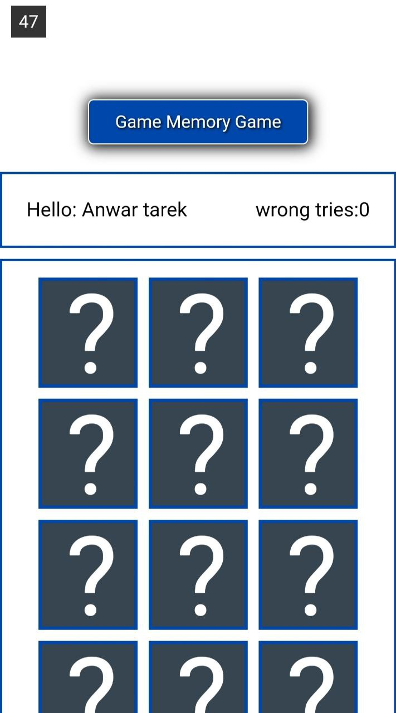

# Game-Memory-With-Javascript
#### Name of Game : Memory Game.
#### description : [Description](description.txt).
###### shape of starting the game:
.
###### shape of next:
.
###### shape of next:
.
###### shape of next:
.
###### shape of next:
.
###### shape of next:
.
###### shape of next:
.
### To start the game [Start](https://anwartareka.github.io/Game-Memory-With-Javascript/).

